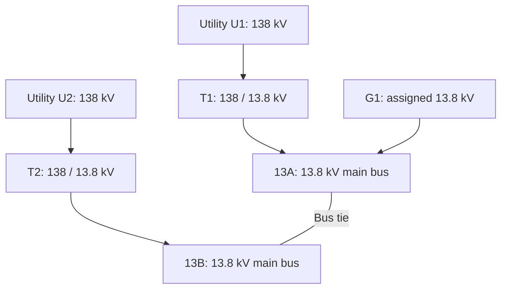

# Industrial Power System Protection and Coordination

**Data Verification, Load-Flow Analysis, Short-Circuit Studies, Cable Sizing, and Protective Device Coordination Using ETAP**

| Project information | Details |
| --- | --- |
| Assignment title | Power System Protection |
| Author | Sai Anirudh Godavarthi |
| Institution | University of Missouri–Kansas City (UMKC) |
| Program | Master’s in Electrical and Computer Engineering |
| Academic term | Fall 2026 |
| Assigned dataset | Student-number column **1–7** |
| Current stage | Part 1 data verification and preliminary engineering calculations |
| Planned study platform | ETAP |

> **Study status:** The Part 1 template and supporting project report have been prepared. Numerical results below are preliminary calculations with stated assumptions. A completed ETAP model, solved load-flow cases, final cable and breaker selections, relay settings, and verified coordination curves are still required.

## Contents

- [Project Overview](#project-overview)
- [Objectives and Scope](#objectives-and-scope)
- [Electrical System](#electrical-system)
- [Equipment Data](#equipment-data)
- [Calculation Methods and Preliminary Results](#calculation-methods-and-preliminary-results)
- [Key Findings and Unresolved Inputs](#key-findings-and-unresolved-inputs)
- [Proposed Protection Scheme](#proposed-protection-scheme)
- [Operating Cases and ETAP Workflow](#operating-cases-and-etap-workflow)
- [Deliverables and Milestones](#deliverables-and-milestones)
- [Repository Organization](#repository-organization)
- [Technical Skills](#technical-skills)
- [Source Documents and References](#source-documents-and-references)

## Project Overview

This academic project develops the protection and control study for an industrial electrical distribution system. The assignment places the engineer in a protection and control role within an engineering, procurement, and construction organization.

The network includes two 138 kV utility connections, a split 13.8 kV main bus, nine transformers, one synchronous generator, synchronous and induction motors, and distribution at 4.16 kV and 480 V.

The project combines equipment-data verification, electrical calculations, ETAP modeling, protective-device selection, and coordination analysis. Its final objective is to establish equipment protection and selective fault clearing across the approved operating configurations.

## Objectives and Scope

1. Verify equipment ratings, connections, grounding, and source data against the supplied documents.
2. Record missing information, conflicting specifications, and justified modeling assumptions.
3. Build the system one-line model in ETAP using the assigned dataset.
4. Analyze load flow for normal, transfer, startup, and emergency conditions.
5. Select cables using demand, installation conditions, voltage drop, and thermal withstand.
6. Determine maximum and minimum phase and ground-fault currents.
7. Evaluate breaker interrupting duty and equipment withstand.
8. Select protective devices, CTs, VTs, and relay functions.
9. Develop setting sheets and time-current coordination curves (TCCs).
10. Document the results, governing study cases, and remaining limitations.

The assignment identifies NEC, OSHA, and IEEE requirements as the design framework. Applicable editions and acceptance criteria must be confirmed before making a compliance conclusion.

## Electrical System

### Main supply connections

This schematic summarizes supply connectivity. The supplied one-line remains the source for individual breakers, feeders, grounding connections, and downstream equipment. Normal switching states are unconfirmed, and G1 has a voltage conflict discussed below.

### Distribution buses and bus ducts

Bus IDs below are study labels used to distinguish repeated drawing tags. Drawing buses are three-phase, three-wire, 60 Hz.

| Study bus | Voltage | Bus rating | Supply path / bus duct |
| --- | --- | ---: | --- |
| 13A / 13B | 13.8 kV | 3,000 A each | T1 / T2 through BD1, 3,000 A |
| 4A / 4B | 4.16 kV | 2,000 A each | T3 / T4 through BD2, 2,000 A |
| 48A / 48B | 480 V | 4,000 A each | T5 / T6 through BD4, 4,000 A |
| 48T7 | 480 V | 800 A | T7 through BD3, 1,200 A |
| 48T8 | 480 V | 800 A | T8 through BD5, 800 A |
| 48T9 | 480 V | 1,600 A | T9 through BD6, 2,000 A |
| 48A1 / 48A2 | 480 V | 1,600 A each | Left MCCs through separate P11 / P12 runs |
| 48B2 / 48B1 | 480 V | 1,600 A each | Right MCCs through separate P11 / P12 runs |

Bus ties connect the 13.8 kV sections, the 4.16 kV sections, and the main 480 V sections. Continuous-current ratings do not establish short-time withstand or breaker interrupting ratings.

## Equipment Data

### Utility sources

| Parameter | U1 | U2 |
| --- | ---: | ---: |
| Nominal voltage | 138 kV | 138 kV |
| Three-phase short-circuit capability | 4,000 MVA | 4,000 MVA |
| Line-to-ground short-circuit capability | 3,000 MVA | 3,000 MVA |
| Three-phase X/R | 14 | 14 |
| Line-to-ground X/R | 14 | 14 |

These values describe the supplied source condition. Separate maximum/minimum utility cases and the relationship between U1 and U2 are not specified.

### Transformers

| Equipment | Ratings, MVA | Voltage ratio, kV | Connection | Assigned impedance |
| --- | --- | --- | --- | --- |
| T1, T2 | 30 / 45 / 60 each | 138 / 13.8 / 13.8 | Delta / wye / delta | H–X: 8.5% on 30 MVA; H–Y and X–Y: 2.5% on 5 MVA |
| T3, T4 | 7.5 / 10 each | 13.8 / 4.16 | Delta / wye | 5.50% |
| T5, T6 | 2.5 / 3.125 each | 13.8 / 0.48 | Delta / wye | 5.75% |
| T7 | 0.750 | 13.8 / 0.48 | Delta / wye | 3.75% |
| T8 | 0.300 | 13.8 / 0.48 | Delta / wye | 3.25% |
| T9 | 1.500 | 13.8 / 0.48 | Delta / wye | 5.75% |

For T1/T2, H is the high-voltage winding, X is the main secondary, and Y is the tertiary. The winding label Y is distinct from the notation for a wye connection.

Preliminary calculations use the lowest listed MVA rating as the impedance base where a base is not explicit. Higher ratings are treated as cooling stages for screening. T1/T2 have H-side ±5% no-load taps and X-side ±15% on-load taps; T3–T9 have H-side ±5% no-load taps. Actual positions, cooling classes, vector groups, losses, and sequence impedances require verification.

### Motors

| Motor | HP per motor | Nameplate voltage | Type | Quantity as supplied |
| --- | ---: | ---: | --- | --- |
| M1 | 14,000 | 13.2 kV | Synchronous | 1 |
| M2 | 10 | 460 V | Induction | 5/5 |
| M3 | 20 | 460 V | Induction | 10/2 |
| M4 | 30 | 460 V | Induction | 5/3 |
| M5 | 50 | 460 V | Induction | 2/1 |
| M6 | 75 | 460 V | Induction | 2/1 |
| M7 | 100 | 460 V | Induction | 1/1 |
| M8 | 125 | 460 V | Induction | 0/0 |
| M9 | 150 | 460 V | Induction | 0/0 |
| M10 | 600 | 4.0 kV | Induction | 1/1 |
| M11 | 1,000 | 4.0 kV | Induction | 1/1 |
| M12 | 400 | 4.0 kV | Induction | 1/1 |
| M13 | 450 | 4.0 kV | Induction | 1/1 |
| M14 | 1,250 | 4.0 kV | Induction | 1/1 |
| M15 | 500 | 4.0 kV | Induction | 1/1 |

All listed motor windings are wye. M2–M15 are assigned four poles; M2–M9 are Design A, code F. M1 is assigned two poles, conflicting with its six-pole reference sheet.

The slash in the quantity column is undefined. Installed, running, and standby quantities must be confirmed and allocated to individual buses. M8/M9 have zero quantities in the selected dataset. Motor nameplate voltages remain separate from the associated 13.8 kV, 4.16 kV, and 480 V bus voltages.

### Generator and static loads

| Item | Assigned or documented information |
| --- | --- |
| G1 | 10.588 MVA, 13.8 kV, synchronous, wye, two poles; quantity 1/1 |
| G1 grounding | GR10: 20 A continuous |
| Generator reference sheet | 9,000 kW, 10.588 MVA, 4.16 kV, four poles, 0.85 power factor |
| Reference reactances | Unsaturated Xd = 1.98 pu, X′d = 0.35 pu, X″d = 0.24 pu; reference-machine base only |
| H1 | Two drawing occurrences at 480 V; kW/kVA, power factor, and duty unspecified |
| H2 | Four drawing occurrences at 480 V; kW/kVA, power factor, and duty unspecified |

The generator reference does not establish the assigned G1 model because voltage and pole count conflict. No generator step-up transformer is shown. Missing H-load values must remain unresolved inputs rather than being entered as zero.

### Cable schedule

Lengths are linear feet; sizes are per conductor. The A1/A2/B1/B2 suffixes distinguish separate physical runs with repeated drawing tags.

| Cable | Length, ft | Size, kcmil | Parallel conductors per phase | Connection |
| --- | ---: | ---: | --- | --- |
| P1 | 1,200 | 600 | 2 | 13A feeder A1 to M1 |
| P2 | 2,000 | 500 | 2 | 13A feeder A2 to T8, with T7 branch |
| P3 | 450 | TBD | 1 | P2 tap to T7 |
| P4 | 200 | TBD | 2 | 13A feeder A3 to T3 |
| P5 | 100 | TBD | 2 | 13A feeder A4 to T5 |
| P6 | 100 | TBD | 2 | 13B feeder B4 to T6 |
| P7 | 200 | TBD | 2 | 13B feeder B3 to T4 |
| P8 | 100 | TBD | TBD | 13B feeder B2 to T9 |
| P10 | 200 | 1,000 | TBD | G1 to generator breaker G |
| P11 A1 | 450 | 750 | TBD | 48A feeder A1 to left outer MCC |
| P11 B2 | 450 | 750 | TBD | 48B feeder B2 to right inner MCC |
| P12 A2 | 275 | 750 | TBD | 48A feeder A2 to left inner MCC |
| P12 B1 | 275 | 750 | TBD | 48B feeder B1 to right outer MCC |

The source identifies no P9 circuit. Cables are listed as copper, shielded, and 90 °C rated. P2/P3 are three-core; the other scheduled cables are single-core. P1–P8 and P10 use EPR insulation; P11/P12 use XHHW. Ambient is 25 °C for P4–P7 and 35 °C for the remaining runs.

Installation code **N-M** is undefined. Installation geometry, termination temperature, bonding, impedances, and actual demand must be resolved before ampacity, voltage-drop, and short-circuit withstand selections are finalized.

### Grounding resistors

| Resistor | Location | Current rating | Duty | Calculated resistance |
| --- | --- | ---: | --- | ---: |
| GR1 | Each T1/T2 secondary neutral, 13.8 kV | 400 A | 10 s | 19.919 Ω |
| GR2 | Each T3/T4 secondary neutral, 4.16 kV | 400 A | 10 s | 6.004 Ω |
| GR3 | Each T5/T6 secondary neutral, 480 V | 10 A | Continuous | 27.713 Ω |
| GR10 | G1 neutral, assigned 13.8 kV | 20 A | Continuous | 398.372 Ω |

Resistance is calculated from nominal phase-to-neutral voltage and assigned resistor current. GR10 remains conditional on the actual generator voltage and grounding arrangement. T7/T8/T9 show solid grounding symbols. Tied-bus cases require reassessment of all connected grounding sources.

## Calculation Methods and Preliminary Results

### Rated three-phase current

For apparent power S in kVA and line-to-line voltage VLL in kV:

$$
I_{rated}\,[A] = \frac{S\,[kVA]}{\sqrt{3}\,V_{LL}\,[kV]}
$$

| Transformer | MVA basis | Calculated secondary current |
| --- | --- | --- |
| T1 / T2 | 30 / 45 / 60 | 1,255.1 / 1,882.7 / 2,510.2 A |
| T3 / T4 | 7.5 / 10 | 1,040.9 / 1,387.9 A |
| T5 / T6 | 2.5 / 3.125 | 3,007.0 / 3,758.8 A |
| T7 | 0.750 | 902.1 A |
| T8 | 0.300 | 360.8 A |
| T9 | 1.500 | 1,804.2 A |

These are rating-based currents, not solved load-flow currents. G1's assigned 10.588 MVA at 13.8 kV similarly gives **443.0 A**.

### Utility fault currents

With short-circuit capability Ssc in MVA and voltage VLL in kV:

$$
I_{sc}\,[kA] = \frac{S_{sc}\,[MVA]}{\sqrt{3}\,V_{LL}\,[kV]}
$$

| Fault type at each 138 kV utility connection | Preliminary symmetrical RMS current |
| --- | ---: |
| Three-phase | 16.735 kA |
| Line-to-ground | 12.551 kA |
| Line-to-line, assuming Z2 = Z1 and a bolted fault | 14.493 kA |

The line-to-ground value assumes the utility reports ground-fault MVA using **Ssc = √3 × VLL × If**. That reporting convention requires confirmation. These values are not separate maximum/minimum cases or breaker interrupting-duty results.

### Per-unit fault screening

On corresponding voltage bases, impedance conversion is:

$$
Z_{pu,new}=Z_{pu,old}\frac{S_{base,new}}{S_{base,old}}
$$

Using a 100 MVA base, utility impedance magnitude is 0.025 pu and T1/T2 H–X impedance is 0.283333 pu. For the simplified series path:

$$
I_{sc}\,[kA]=\frac{S_{base}\,[MVA]}{\sqrt{3}\,V_{LL}\,[kV]\,Z_{total,pu}}
$$

| Fault location | One utility path | Individual transformer with stiff primary source |
| --- | ---: | ---: |
| T1 / T2 secondary | 13.569 kA | 14.766 kA |
| T3 / T4 secondary | 13.323 kA | 18.925 kA |
| T5 / T6 secondary | 46.114 kA | 52.296 kA |
| T7 secondary | 22.659 kA | 24.056 kA |
| T8 secondary | 10.796 kA | 11.103 kA |
| T9 secondary | 29.042 kA | 31.378 kA |

Assumptions: one utility path; relevant ties open; nominal voltage and taps; bolted faults at transformer secondary terminals; generator and motor contributions excluded; cable and bus-duct impedances omitted; source and transformer impedance magnitudes treated as aligned inductive impedances.

The stiff-primary comparison includes only the individual transformer's impedance. Neither column establishes plant-wide maximum fault duty, minimum protection sensitivity, or final breaker ratings.

### Grounding and bus capacity

With voltage in volts, resistor current in amperes, and resistance in ohms:

$$
R_N=\frac{V_{LL}}{\sqrt{3}\,I_N}
$$

Three-phase bus capacity at nominal voltage is:

$$
S_{bus}\,[kVA]=\sqrt{3}\,V_{LL}\,[kV]\,I_{bus}\,[A]
$$

| Branch | Transformer rated current | Downstream bus | Bus capacity at 480 V |
| --- | ---: | ---: | ---: |
| T7 | 902.1 A | 800 A | 665.1 kVA |
| T9 | 1,804.2 A | 1,600 A | 1,330.2 kVA |

Each bus supports approximately **88.68%** of its transformer's nameplate kVA. Actual demand must respect the limiting component. These comparisons identify capacity restrictions; actual overload cannot be concluded without demand data.

### Conditional medium-voltage motor demand

Using catalogue efficiency and power-factor analogues, one fully loaded motor of each listed type, nominal 4.16 kV bus voltage, and no cable/transformer losses:

| Group | Motors | Active power | Reactive power | Bus current |
| --- | --- | ---: | ---: | ---: |
| 4A | M10–M12 | 1,575.4 kW | 863.8 kvar | 249.4 A |
| 4B | M13–M15 | 1,732.2 kW | 924.0 kvar | 272.5 A |
| Combined | M10–M15 | 3,307.6 kW | 1,787.7 kvar | 521.8 A |

These are conditional demand estimates using vector addition of active and reactive power. Catalogue analogues require confirmation against actual motors; this table is not an ETAP load-flow solution.

## Key Findings and Unresolved Inputs

| Finding | Effect on the study / required resolution |
| --- | --- |
| G1 assignment is 13.8 kV and two poles; reference is 4.16 kV and four poles | Confirm generator identity and any missing transformation before using machine constants |
| M1 assignment is two poles with X′ = 0.28 pu; reference is six poles with X′d = 0.478 pu | Resolve the intended machine before using starting, fault, or thermal data |
| T3/T4 assigned impedance is 5.50%; references list 6.2941% and 6.5% | Identify the applicable transformer record and retain a consistent model |
| T1/T2 printed impedance-base headings conflict with selected cells | Confirm the 30 MVA and 5 MVA cell-specific bases used in the preliminary work |
| T7/T9 transformer rated currents exceed downstream bus ratings | Confirm demand restrictions or revise equipment ratings |
| H1/H2 ratings and motor quantity meanings are missing | Complete the load schedule before solving demand and load flow |
| Cable installation, several sizes, parallel counts, and impedances are incomplete | Complete cable selection and remote-fault calculations |
| Breaker/fuse/relay characteristics and CT/VT data are missing | Obtain device ratings, curves, ratios, burdens, and clearing times |
| Switching states, utility minimum/maximum data, and damage curves are unresolved | Establish approved cases and protection constraints |

M1's 14,000 HP corresponds to approximately **10.440 MW of shaft output**. If the reference generator's 9 MW limit applies to G1, M1 alone exceeds that active-power capability. An emergency island would require a confirmed essential-load and starting schedule.

## Proposed Protection Scheme

The drawing identifies **24 circuit-breaker positions marked ANSI device 52**, together with fused transformer and motor branches. Their device-specific ratings and curves remain to be selected or verified.

| Protected zone | Proposed functions / approach |
| --- | --- |
| Utility incomers | Phase and ground overcurrent (50/51); directional elements (67) where needed; breaker failure (50BF) |
| T1–T6 | Transformer differential (87T), backup overcurrent, neutral-ground protection, thermal protection (49), and applicable mechanical devices |
| T7–T9 | Primary fuses coordinated with transformer inrush/damage and secondary protection |
| Main buses and ties | Bus differential (87B) where justified, breaker failure, interlocking, and synchronism check (25) for live-source paralleling |
| M1 synchronous motor | Differential (87M), thermal (49), unbalance (46), start/stall protection, overcurrent, ground fault, excitation and synchronism functions |
| M10–M15 | Coordinated fuses/contactors, overload, start/stall, unbalance, phase and ground protection |
| LV motors and static loads | Branch short-circuit protection, applicable motor overloads, and coordinated feeder breaker functions |
| G1 | Differential (87G), reverse power (32), loss of field (40), unbalance (46), thermal (49), overexcitation (24), voltage/frequency, ground fault, and synchronization |

Final settings must consider maximum intended load, starting/inrush, minimum fault current, CT performance, manufacturer tolerances, total clearing time, and equipment damage curves. Numerical pickups, fuse sizes, relay time settings, and breaker interrupting classes have not been released.

Required TCC groups cover utility/main transformers, MV motor paths, LV MCC paths, T7/T8/T9 branches, the generator intertie, and ground-fault paths. Selectivity must be checked using actual device curves and applicable manufacturer selectivity data.

## Operating Cases and ETAP Workflow

### Proposed study cases

| Case | Configuration to establish | Main study purpose |
| --- | --- | --- |
| Normal split | U1/T1 and U2/T2 energized; ties open; G1 status confirmed | Normal loading and source demand |
| Normal generation | Approved utility connection with synchronized G1 | Dispatch, reactive power, and power-flow direction |
| Main transfer | One source isolated; 13.8 kV tie closed | Surviving-source, feeder, and tie loading |
| Downstream transfer | One T3/T4 or T5/T6 main isolated; corresponding tie closed | Transformer and downstream distribution capacity |
| Startup | Largest required motor starts on the applicable source | Voltage dip, acceleration, and thermal margin |
| Emergency island | Utilities isolated; G1 supplies selected essential loads | Generation adequacy, sequencing, and load shedding |
| Maximum/minimum fault | Approved combinations of source strength, ties, generator, and operating motors | Equipment duty and protection sensitivity |

These are proposed cases, not verified switching instructions.

### Study workflow

1. Resolve the data questions and approve the operating configurations.
2. Build the ETAP one-line, preserving unique equipment IDs and physical feeder allocation.
3. Enter verified ratings, sequence impedances, grounding, taps, cable construction, and motor/generator models.
4. Define load allocations, loading factors, standby status, and generator dispatch.
5. Run load flow; record bus voltages, branch currents, MW/Mvar, loading, and losses.
6. Check motor starting and finalize cable selections against operating and thermal constraints.
7. Run phase and ground-fault studies for maximum/minimum cases, including applicable motor and generator contributions.
8. Evaluate momentary, interrupting, and withstand duties using the selected equipment's rating basis.
9. Select devices and develop coordinated TCCs, logic, and setting sheets.
10. Export the model, results, assumptions, and final report with traceable revisions.

## Deliverables and Milestones

Dates below are the assignment milestones. Status reflects the available project documentation.

| Due date | Deliverable | Current status |
| --- | --- | --- |
| September 14, 2026 | Data verification and Part 1 template | Prepared; unresolved fields and conflicts documented |
| September 28, 2026 | ETAP one-line, load flow, and cable selection | Pending validated model and final inputs |
| October 12, 2026 | Short-circuit analysis and breaker selection | Preliminary calculations available; full duty study pending |
| November 2, 2026 | Fuse and LV power circuit-breaker selection/settings | Protection approach documented; selections pending |
| November 18, 2026 | Relay selection and setting calculations | Function scope documented; numerical settings pending |
| December 4, 2026 | Final report | Requires the remaining validated study outputs |

Prepared documentation:

- `Project_Part_1_Completed.docx` — completed equipment-data template with unresolved items identified.
- `Power_System_Protection_Project_Report.docx` — supporting report containing schedules, preliminary calculations, diagrams, proposed protection functions, and verification questions.

## Repository Organization

The following is a **suggested layout** for organizing the project on GitHub. It does not imply that pending models or results have already been created.

| Location | Intended contents |
| --- | --- |
| `README.md` | Project overview, data basis, findings, and progress |
| `docs/` | Part 1 template, supporting report, and final report revisions |
| `diagrams/` | Supplied one-line and subsequent model exports |
| `data/` | Assigned equipment schedules and applicable reference data |
| `calculations/` | Calculation worksheets or scripts with documented assumptions |
| `etap/` | ETAP model and study cases when completed |
| `results/load-flow/` | Solved load-flow reports when available |
| `results/short-circuit/` | Fault-current and equipment-duty reports when available |
| `results/coordination/` | TCC exports and setting sheets when available |

Place this file at the repository root. Add the supporting files to the appropriate folders and update the study status as each deliverable is completed.

## Technical Skills

- Industrial electrical distribution modeling and one-line interpretation.
- Equipment-data verification and engineering assumption management.
- Three-phase calculations, per-unit modeling, and fault-current screening.
- Transformer loading, grounding, and cable-selection analysis.
- Motor/generator modeling and operating-case development.
- Protective relaying, instrument transformers, and selective coordination.
- ETAP study preparation and technical report development.

## Source Documents and References

Project-specific inputs and calculations are based on the supplied documents:

| Source | Purpose |
| --- | --- |
| `Project Assignment Fall 2026.docx` | Scope, student dataset, required studies, and deadlines |
| `Project Part 1 Template.docx` | Data-verification submission structure |
| `Oneline Diagram.pdf` | System connectivity, bus ratings, and device locations |
| `Project_Data_U-TR.pdf` | Utility and transformer data |
| `Project_Data_Motors.pdf` | Motor/generator assignments and reactance guidance |
| `Project_Data_P.pdf` | Cable schedule and construction data |
| `Project_Data_GRN_BD.pdf` | Grounding-resistor and bus-duct ratings |
| `SM_14000HP.pdf` | M1 reference data; applicability conflicts recorded |
| `SG_Data_9000kW.pdf` | Generator reference data; voltage/pole conflicts recorded |
| `TR_7500KVA.pdf`, `TR_7500KVA-1.pdf` | Transformer references; assigned-data conflicts recorded |
| `IM_TypData.pdf` | Typical induction-motor analogue data |
| `IM_TypData_460V60Hz.pdf`, `IMs_2300V.pdf`, `IM_4000Hp.pdf` | Additional motor reference records; equipment applicability requires verification |

The assignment names **IEEE Recommended Practice for Electric Power Distribution for Industrial Plants (IEEE 141)** and **IEEE 242-2001, Recommended Practice for Protection and Coordination of Industrial and Commercial Power Systems**, as course references.

Source conflicts and detailed calculation assumptions are recorded in the supporting project report. Displayed values are rounded; calculations retain unrounded inputs.
